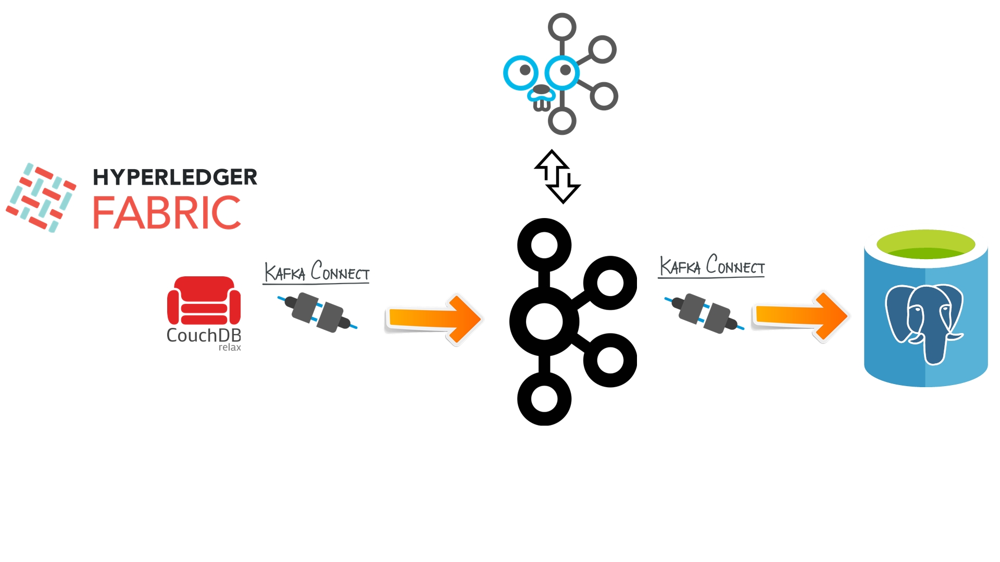
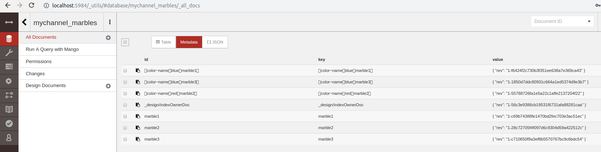
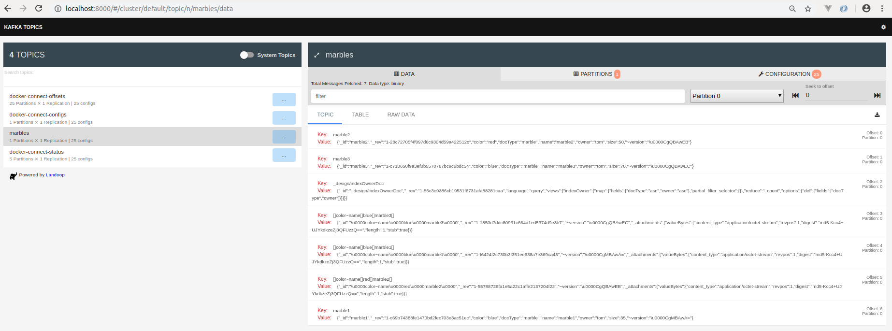
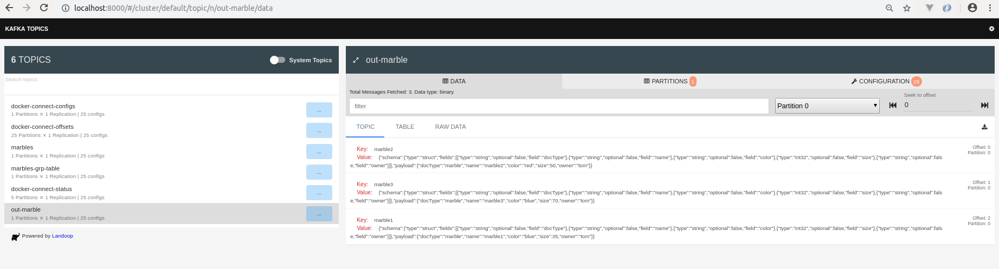
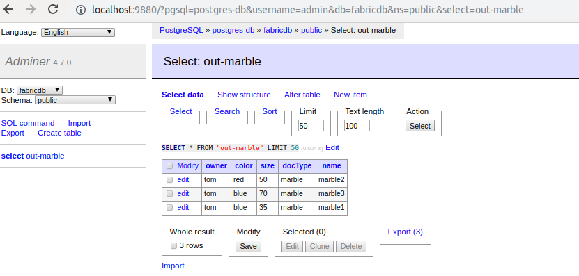

# Hyperledger Fabric Blockchain world-state data (CouchDB) on Kafka!



## start fabric docker network

> This is a copy from https://github.com/hyperledger/fabric-samples

Start fabric docker network locally
```

cd fabric/basic-network
./start.sh

```

## Some Marbles on Blockchain
Above step will create some marbles on Blockchain and can be seen on CouchDB (world-state)
Browse to http://localhost:5984/_utils/#database/mychannel_marbles/_all_docs
User/Password is admin/admin




## CoudhDB/Cloudant Kafka Connector

Build connector and copy JARs to connector folder or use the ones in github repo /kafka/connector.

For more details refer to : https://github.com/cloudant-labs/kafka-connect-cloudant

## Setup Kafka

The command below will setup docker containers within same network as above fabric basic network.

```
cd kafka
./setup.sh
sleep 60
./setup-connector.sh
```

## See messages on Kafka Topic
Browse to http://localhost:8000/#/cluster/default/topic/n/marbles/data to view any messages on topic




## Start Kafka Stream Processor
Start the Stream Processor which will process messages from marbles topic and outbound messages on topic 'out-marble'. Later these messages will be consumed by JDBC Sink Connector to store in PostgresDB

```
cd strmproc
make run
```
## See processed messages on Kafka Topic
Browse to http://localhost:8000/#/cluster/default/topic/n/out-marble/data to view any messages on topic



## See records within Postgres DB
Brose to http://localhost:9880/?pgsql=postgres-db&username=admin&db=fabricdb&ns=public&select=out-marble to see marbles now on PostgresDB

Login password is admin for user admin

